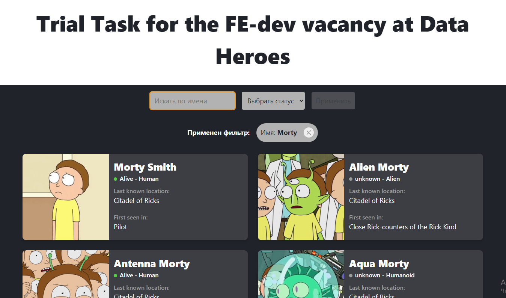

# Тестовое задание на вакансию Frontend-разработчик в компании Data Heroes

## Деплой приложения
[здесь](https://ivan-gav.github.io/data-heroes-test/)

## Скриншот

## Стэк
- Vue 3
- Vue Query
- TypeScript
- Vite

## Задание
Создать страницу, на которой можно будет просматривать персонажей из Рика и Морти с помощью открытого api

### Формальные требования к выполнению задачи
- Использовать vue3 или vue2, composition api
- Персонажей выводить в виде карточек, как в источнике. Ссылки на карточке заменить на обычный текст
- Реализовать пагинацию с помощью api
- Реализовать фильтрацию по полям "name" и "status" с помощью api. Фильтрация должна применяться по нажатию на кнопку "Применить"
- Для элементов пагинации и фильтрации можно использовать обычные html теги (input, select) без стилизации
- Код разместить в репозитории github
- Готовое приложение разместить на github pages или аналогичном сервисе
### Источник данных
- Сайт https://rickandmortyapi.com/
- Документация размещена на сайте